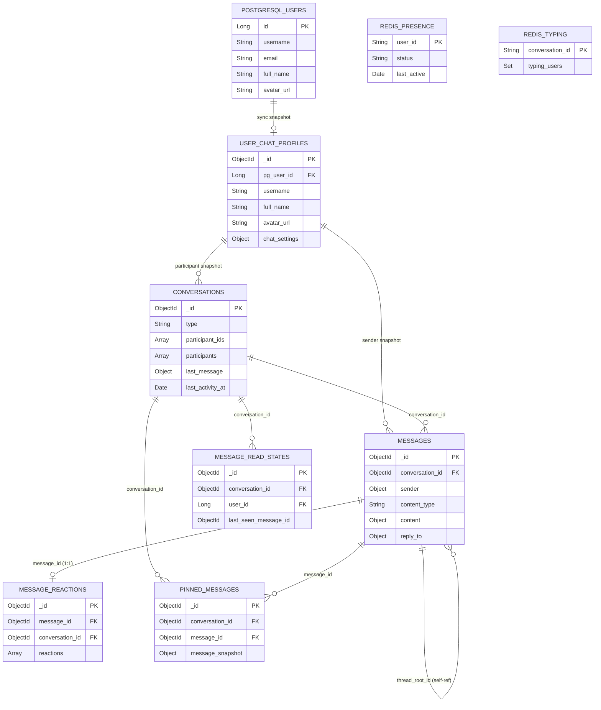

# MongoDB Schema — Part 3: Shard Keys, Relationships, Query Patterns

## 4. Shard Key Recommendations

| Collection | Shard Key | Chiến lược | Lý do |
|-----------|-----------|-----------|-------|
| `messages` | `{ conversation_id: "hashed" }` | Hashed sharding | Phân tán đều messages across shards. Mọi query message đều filter theo `conversation_id` → targeted queries (scatter-gather tối thiểu). |
| `message_read_states` | `{ conversation_id: "hashed" }` | Hashed sharding | Cùng shard key với messages → co-located queries. |
| `message_reactions` | `{ conversation_id: "hashed" }` | Hashed sharding | Load reactions cùng lúc load messages → co-locate |
| `conversations` | **Không shard** (ban đầu) | — | Kích thước nhỏ hơn nhiều. Khi > 100M conversations → shard theo `{ _id: "hashed" }` |
| `user_chat_profiles` | **Không shard** | — | 1 document/user, kích thước nhỏ |
| `pinned_messages` | **Không shard** | — | Kích thước rất nhỏ |

> [!IMPORTANT]
> **Tại sao `conversation_id` thay vì `_id`?** Vì pattern chính là load messages theo conversation. Nếu shard theo `_id`, mỗi query phải scatter-gather qua tất cả shards → latency cao. Shard theo `conversation_id` đảm bảo tất cả messages của 1 conversation nằm trên cùng shard → **targeted query**.

---

## 5. Sơ Đồ Quan Hệ (Relationship Diagram)



### Tóm tắt luồng dữ liệu

```
PostgreSQL (User Auth) ──sync──► user_chat_profiles (MongoDB)
                                      │
                                      ├──snapshot──► conversations.participants
                                      └──snapshot──► messages.sender

conversations ◄──conversation_id──► messages
conversations ◄──conversation_id──► message_read_states
conversations ◄──conversation_id──► pinned_messages
messages      ◄──message_id──────► message_reactions (1:1)
messages      ◄──thread_root_id──► messages (self-reference)

Redis: presence:{user_id}, typing:{conversation_id} (ephemeral, không persist)
```

---

## 6. Query Pattern Guide

### 6.1 Load danh sách conversation cho user (sorted by latest, with unread)

```javascript
// Spring Data MongoDB (Java equivalent below)
db.conversations.find(
  {
    participant_ids: 1001,
    deleted_at: null
  }
)
.sort({ last_activity_at: -1 })
.limit(20)
.projection({
  name: 1, type: 1, avatar_url: 1,
  last_message: 1, last_activity_at: 1,
  member_count: 1, "unread_counts.1001": 1,
  participants: { $slice: 4 }          // chỉ lấy 4 participants đầu cho avatar group
})
```

```java
// Spring Data MongoDB — ReactiveMongoTemplate
Query query = new Query()
    .addCriteria(Criteria.where("participant_ids").is(userId)
        .and("deleted_at").is(null))
    .with(Sort.by(Sort.Direction.DESC, "last_activity_at"))
    .limit(20);

query.fields()
    .include("name", "type", "avatar_url", "last_message",
             "last_activity_at", "member_count")
    .include("unread_counts." + userId)
    .slice("participants", 4);

Flux<Conversation> conversations = reactiveMongoTemplate.find(query, Conversation.class);
```

**Index sử dụng**: `idx_user_conversations_latest` → `{ participant_ids: 1, last_activity_at: -1 }`

---

### 6.2 Load messages (cursor-based pagination, newest first)

```javascript
// Page đầu tiên (không có cursor)
db.messages.find({
  conversation_id: ObjectId("665a..."),
  deleted_for_everyone: false,
  deleted_for: { $ne: 1001 }           // ẩn tin đã xóa "cho tôi"
})
.sort({ _id: -1 })
.limit(30)

// Page tiếp theo (có cursor = _id của message cuối trang trước)
db.messages.find({
  conversation_id: ObjectId("665a..."),
  _id: { $lt: ObjectId("665b...") },   // cursor
  deleted_for_everyone: false,
  deleted_for: { $ne: 1001 }
})
.sort({ _id: -1 })
.limit(30)
```

```java
// Spring Data MongoDB
Query query = new Query()
    .addCriteria(Criteria.where("conversation_id").is(conversationId)
        .and("deleted_for_everyone").is(false)
        .and("deleted_for").ne(userId));

if (cursor != null) {
    query.addCriteria(Criteria.where("_id").lt(new ObjectId(cursor)));
}

query.with(Sort.by(Sort.Direction.DESC, "_id")).limit(30);
Flux<Message> messages = reactiveMongoTemplate.find(query, Message.class);
```

**Index sử dụng**: `idx_conversation_messages_cursor` → `{ conversation_id: 1, _id: -1 }`

> [!TIP]
> **Tại sao cursor-based thay vì offset?** Offset (`skip(N)`) phải scan qua N documents → O(N). Cursor (`_id < lastId`) nhảy thẳng vào B-tree → O(log N). Với hàng triệu messages, cursor nhanh hơn hàng nghìn lần.

---

### 6.3 Mark all as read

```java
// Step 1: Lấy message mới nhất trong conversation
Mono<Message> latestMsg = reactiveMongoTemplate.findOne(
    new Query(Criteria.where("conversation_id").is(convId))
        .with(Sort.by(Sort.Direction.DESC, "_id")).limit(1),
    Message.class
);

// Step 2: Update read state  +  Reset unread count (parallel)
Mono<Void> updateReadState = reactiveMongoTemplate.upsert(
    new Query(Criteria.where("conversation_id").is(convId)
        .and("user_id").is(userId)),
    new Update()
        .set("last_seen_message_id", latestMsg.getId())
        .set("last_seen_at", Instant.now())
        .set("last_delivered_message_id", latestMsg.getId())
        .set("last_delivered_at", Instant.now()),
    MessageReadState.class
).then();

Mono<Void> resetUnread = reactiveMongoTemplate.updateFirst(
    new Query(Criteria.where("_id").is(convId)),
    new Update().set("unread_counts." + userId, 0),
    Conversation.class
).then();

Mono.when(updateReadState, resetUnread).subscribe();
```

---

### 6.4 Fetch message thread (parent + replies)

```javascript
// Load parent message + tất cả replies
db.messages.find({
  $or: [
    { _id: ObjectId("parentMsgId") },            // parent
    { thread_root_id: ObjectId("parentMsgId") }   // replies
  ]
})
.sort({ _id: 1 })   // chronological order cho thread
.limit(50)
```

**Index sử dụng**: `idx_thread_replies` (partial index trên `thread_root_id`)

---

### 6.5 Search messages by keyword

```javascript
db.messages.find({
  conversation_id: ObjectId("665a..."),
  $text: { $search: "review PR" },
  deleted_for_everyone: false
},
{
  score: { $meta: "textScore" }
})
.sort({ score: { $meta: "textScore" } })
.limit(20)
```

> [!WARNING]
> MongoDB text search cho tiếng Việt có giới hạn (không hỗ trợ stemming/dấu). Cho production, recommend **Atlas Search** (Lucene-based) hoặc **Elasticsearch** sidecar cho full-text search tiếng Việt chính xác.

---

### 6.6 Get presence status (Redis)

```java
// Redis — sử dụng Spring Data Redis
// Key pattern: presence:{userId} → Hash { status, last_active }

public Flux<UserPresence> getPresenceForUsers(List<Long> userIds) {
    return Flux.fromIterable(userIds)
        .flatMap(userId -> {
            String key = "presence:" + userId;
            return reactiveRedisTemplate.opsForHash()
                .entries(key)
                .collectMap(Map.Entry::getKey, Map.Entry::getValue)
                .map(map -> new UserPresence(
                    userId,
                    (String) map.getOrDefault("status", "OFFLINE"),
                    (String) map.get("last_active")
                ));
        });
}

// Set presence khi user connect WebSocket
public Mono<Void> setOnline(Long userId) {
    String key = "presence:" + userId;
    return reactiveRedisTemplate.opsForHash()
        .putAll(key, Map.of("status", "ONLINE", "last_active", Instant.now().toString()))
        .then(reactiveRedisTemplate.expire(key, Duration.ofMinutes(5)))  // TTL auto-offline
        .then();
}

// Typing indicator — Redis SET with TTL
// Key: typing:{conversationId} → SET of userIds, TTL 3 seconds
public Mono<Void> setTyping(Long userId, String conversationId) {
    String key = "typing:" + conversationId;
    return reactiveRedisTemplate.opsForSet().add(key, userId.toString())
        .then(reactiveRedisTemplate.expire(key, Duration.ofSeconds(3)))
        .then();
}
```

---

### 6.7 Add/Remove emoji reaction

```java
// THÊM reaction
public Mono<UpdateResult> addReaction(ObjectId messageId, ObjectId conversationId,
                                       Long userId, String emoji) {
    // Try update existing emoji group first
    Query query = new Query(Criteria.where("message_id").is(messageId)
        .and("reactions.emoji").is(emoji));
    Update update = new Update()
        .push("reactions.$.users", new ReactionUser(userId, Instant.now()))
        .inc("reactions.$.count", 1)
        .inc("total_reaction_count", 1);

    return reactiveMongoTemplate.updateFirst(query, update, MessageReaction.class)
        .flatMap(result -> {
            if (result.getModifiedCount() == 0) {
                // Emoji chưa tồn tại → thêm emoji group mới
                return reactiveMongoTemplate.upsert(
                    new Query(Criteria.where("message_id").is(messageId)),
                    new Update()
                        .push("reactions", new Reaction(emoji, 1,
                            List.of(new ReactionUser(userId, Instant.now()))))
                        .inc("total_reaction_count", 1)
                        .setOnInsert("conversation_id", conversationId),
                    MessageReaction.class
                );
            }
            return Mono.just(result);
        });
}
```

---

*Tiếp tục ở Part 4: Redis strategy, Anti-patterns, Migration notes*
