# 🏗️ ViVuMate — System Architecture Design (Production-Grade)

> **Mục tiêu**: Thiết kế kiến trúc backend hoàn chỉnh cho ứng dụng chat real-time phục vụ **hàng triệu người dùng**, với hiệu năng cao, dễ mở rộng, độ sẵn sàng cao (HA), lưu trữ dữ liệu vĩnh viễn.

---

## 1. Tổng Quan Kiến Trúc (High-Level Architecture)

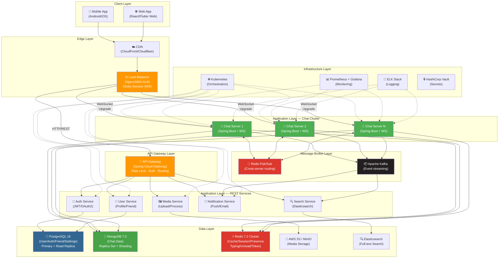

---

## 2. Tech Stack Recommendations (Production-Grade)

### 2.1 Giữ nguyên (Core — đã có)

| Layer | Technology | Version | Vai trò |
|-------|-----------|---------|---------|
| Language | **Java** | **21** (LTS) | Virtual Threads, Pattern Matching, Record Patterns, Structured Concurrency |
| Framework | **Spring Boot** | **3.5.x** | Servlet stack + WebSocket STOMP |
| RDBMS | **PostgreSQL** | **16** + PostGIS | User/Auth/Friend/Settings, ACID |
| NoSQL | **MongoDB** | **7.0** | Chat messages, conversations |
| Cache | **Redis** | **7.2** | Session, Presence, Typing, Unread, Token blacklist |
| Security | **Spring Security + JWT** | jjwt 0.12.3 | Stateless auth, multi-key JWT |

### 2.2 Bổ sung mới (Upgrade Path)

| Layer | Technology | Lý do bổ sung |
|-------|-----------|---------------|
| **WebSocket** | **Spring WebSocket + STOMP** | Giao thức chuẩn cho real-time messaging, tích hợp native với Spring |
| **Message Broker (Internal)** | **Redis Pub/Sub** | Cross-server message routing giữa các Chat Server instances (lightweight, đã có Redis) |
| **Event Streaming** | **Apache Kafka** | Durable event log cho notifications, search indexing, analytics. Không mất message khi consumer down |
| **Media Storage** | **AWS S3 / MinIO** | Object storage cho images, files, videos. MinIO cho self-hosted/dev |
| **Full-text Search** | **Elasticsearch 8.x** | Tìm kiếm tin nhắn nâng cao, index async từ Kafka |
| **API Gateway** | **Spring Cloud Gateway** | Centralized routing, rate limiting, auth propagation |
| **Service Discovery** | **Spring Cloud Netflix Eureka** hoặc **Kubernetes Service** | Auto-discovery khi scale Chat Server instances |
| **Monitoring** | **Micrometer + Prometheus + Grafana** | Metrics, dashboards, alerting |
| **Logging** | **ELK Stack** (Elasticsearch + Logstash + Kibana) | Centralized logging, trace correlation |
| **Tracing** | **OpenTelemetry + Jaeger/Zipkin** | Distributed tracing cho debug cross-service |
| **CI/CD** | **GitHub Actions + Docker + Kubernetes** | Automated build, test, deploy |
| **Secret Management** | **HashiCorp Vault** hoặc **AWS Secrets Manager** | Quản lý keys, passwords, certificates |

### 2.3 Tận dụng sức mạnh Java 21

> [!IMPORTANT]
> Java 21 mang đến những tính năng game-changing cho ứng dụng chat real-time. Dưới đây là cách tận dụng tối đa:

| Feature | Áp dụng | Lợi ích |
|---------|---------|---------|
| **Virtual Threads** (JEP 444) | WebSocket handler, blocking I/O calls (DB, Redis, HTTP) | Hàng triệu concurrent connections với memory footprint nhỏ. 1 virtual thread per WS connection thay vì pool-based |
| **Structured Concurrency** (JEP 453 - Preview) | Fan-out: gửi message + update unread + notify cùng lúc | Code concurrent dễ đọc, tự cancel subtask khi parent fail |
| **Scoped Values** (JEP 446 - Preview) | Truyền userId/requestId qua call chain trong virtual threads | Thay thế ThreadLocal (không phù hợp với virtual threads) |
| **Pattern Matching** (JEP 441) | Xử lý polymorphic message content types | `switch(content) { case TextContent t -> ...; case ImageContent i -> ...; }` |
| **Record Patterns** (JEP 440) | Destructure DTOs trong event handlers | Clean code cho event processing |
| **Sequenced Collections** (JEP 431) | Message ordering, participant list management | `getFirst()`, `getLast()`, `reversed()` |

**Cấu hình Virtual Threads cho Spring Boot 3.5:**

```yaml
# application.yml
spring:
  threads:
    virtual:
      enabled: true    # Tự đông dùng virtual threads cho Tomcat, @Async, @Scheduled

server:
  tomcat:
    threads:
      max: 200         # Platform threads cho Tomcat connector (vẫn cần)
    # Virtual threads sẽ handle request processing
```

```java
// WebSocket Configuration với Virtual Threads
@Configuration
@EnableWebSocketMessageBroker
public class WebSocketConfig implements WebSocketMessageBrokerConfigurer {

    @Override
    public void configureClientInboundChannel(ChannelRegistration registration) {
        // Sử dụng virtual thread executor cho inbound messages
        registration.taskExecutor()
            .corePoolSize(1)
            .maxPoolSize(Integer.MAX_VALUE);
    }

    @Bean
    public TaskExecutor virtualThreadExecutor() {
        return new TaskExecutorAdapter(
            Executors.newVirtualThreadPerTaskExecutor()
        );
    }
}
```

---

## 3. Chiến Lược Lưu Trữ — Polyglot Persistence (Chi tiết)

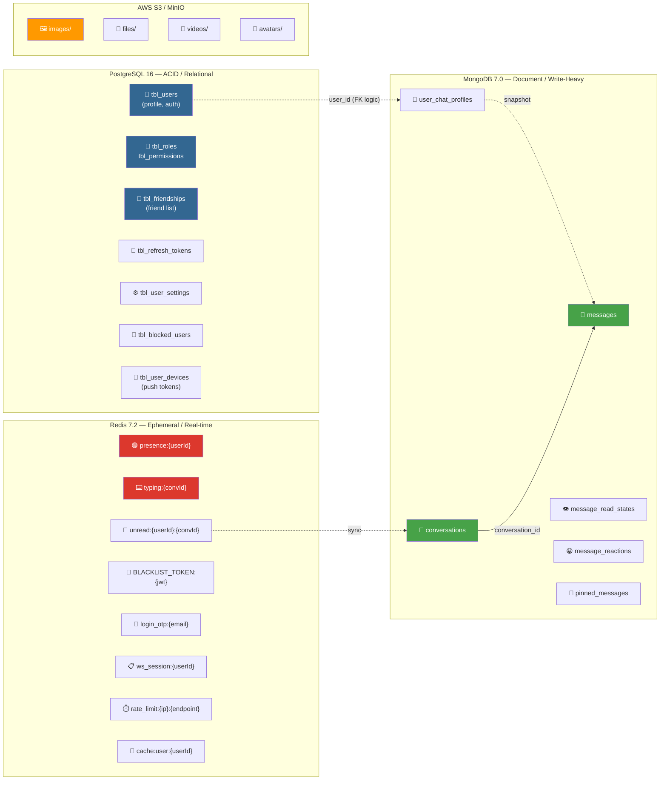

### PostgreSQL — Bổ sung Tables mới

| Table | Mô tả | Quan trọng |
|-------|--------|------------|
| `tbl_friendships` | Quản lý bạn bè (user_id, friend_id, status, created_at) | Relation: PENDING → ACCEPTED → BLOCKED |
| `tbl_blocked_users` | Danh sách chặn | blocker_id, blocked_id |
| `tbl_user_settings` | Cài đặt người dùng | notification preferences, privacy, language |
| `tbl_user_devices` | Thiết bị + push token | device_id, platform, push_token, is_active |
| `tbl_friend_requests` | Lời mời kết bạn | sender_id, receiver_id, status, message |

---

## 4. Người Điều Phối (The Orchestrator)

### 4.1 Vai trò của từng thành phần

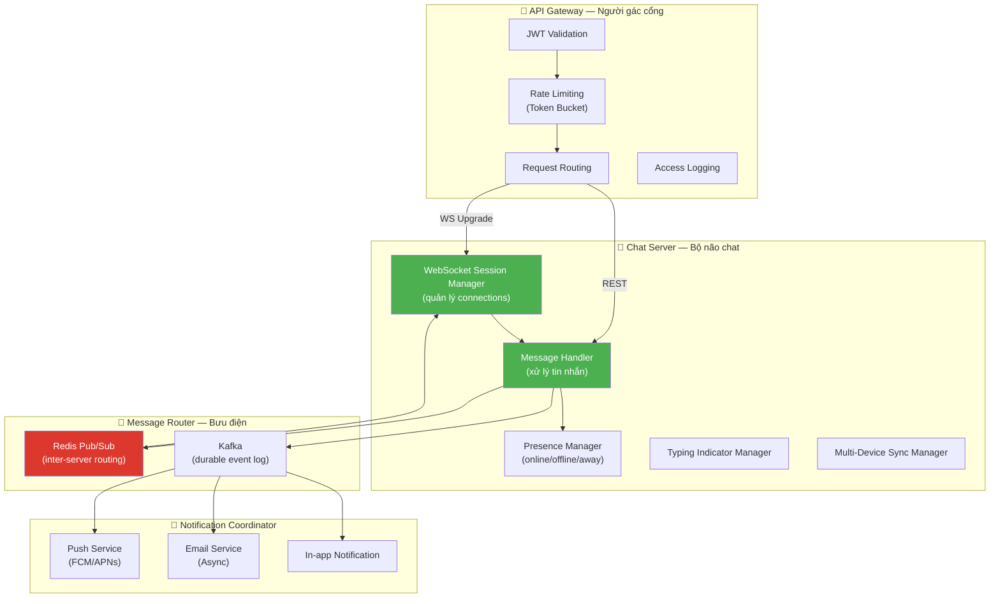

### 4.2 WebSocket Session Manager

```java
/**
 * Quản lý mapping userId → Set<WebSocketSession>
 * Hỗ trợ multi-device: 1 user có thể có nhiều session (phone + web + tablet)
 */
@Component
@RequiredArgsConstructor
public class WebSocketSessionManager {

    // Local sessions trên server instance này
    // ConcurrentHashMap<userId, Set<sessionId>>
    private final ConcurrentHashMap<Long, Set<String>> localUserSessions = new ConcurrentHashMap<>();

    // Redis: mapping userId → Set<serverId> (user đang connect ở server nào)
    // Key: ws_routing:{userId}  Value: Set<serverId>
    private final RedisTemplate<String, String> redisTemplate;

    /**
     * Khi user connect WebSocket
     */
    public void registerSession(Long userId, String sessionId) {
        localUserSessions.computeIfAbsent(userId, k -> ConcurrentHashMap.newKeySet())
                         .add(sessionId);
        // Đăng ký server instance này đang hold connection của userId
        redisTemplate.opsForSet().add("ws_routing:" + userId, SERVER_ID);
    }

    /**
     * Khi user disconnect
     */
    public void removeSession(Long userId, String sessionId) {
        Set<String> sessions = localUserSessions.get(userId);
        if (sessions != null) {
            sessions.remove(sessionId);
            if (sessions.isEmpty()) {
                localUserSessions.remove(userId);
                redisTemplate.opsForSet().remove("ws_routing:" + userId, SERVER_ID);
            }
        }
    }

    /**
     * Kiểm tra user có online trên server này không
     */
    public boolean isUserLocallyConnected(Long userId) {
        return localUserSessions.containsKey(userId);
    }

    /**
     * Lấy danh sách server đang hold connection của userId
     */
    public Set<String> getServersForUser(Long userId) {
        return redisTemplate.opsForSet().members("ws_routing:" + userId);
    }
}
```

---

## 5. Hành Trình Của Một Tin Nhắn (Message Journey)

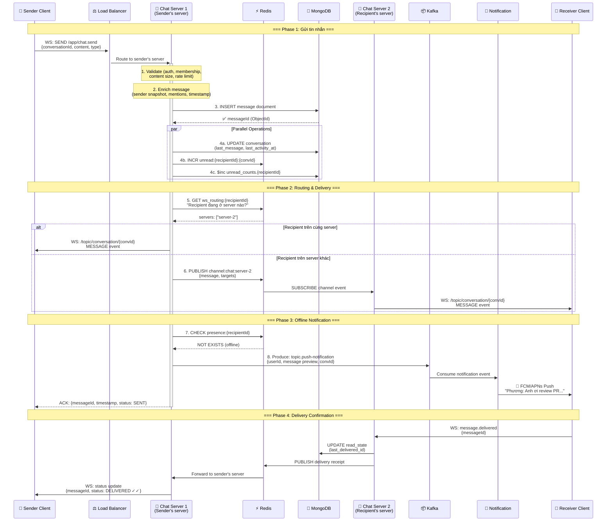

### 5.1 Message Processing Pipeline (Chi tiết code)

```java
@Service
@RequiredArgsConstructor
@Slf4j(topic = "MESSAGE_SERVICE")
public class MessageServiceImpl implements MessageService {

    private final MongoTemplate mongoTemplate;
    private final RedisTemplate<String, String> redisTemplate;
    private final WebSocketSessionManager sessionManager;
    private final SimpMessagingTemplate messagingTemplate;
    private final KafkaTemplate<String, ChatEvent> kafkaTemplate;

    /**
     * Sử dụng Structured Concurrency (Java 21) để xử lý parallel operations
     */
    @Override
    public MessageResponse sendMessage(Long senderId, SendMessageRequest request) {
        // 1. VALIDATE
        ConversationDocument conversation = validateAndGetConversation(
            request.getConversationId(), senderId
        );

        // 2. BUILD MESSAGE
        MessageDocument message = buildMessage(senderId, request, conversation);

        // 3. PERSIST (MongoDB)
        MessageDocument saved = mongoTemplate.insert(message);
        log.info("(Success) Message persisted: {}", saved.getId());

        // 4. PARALLEL: Update conversation + Route message + Notify
        //    Sử dụng Virtual Threads + Structured Concurrency
        try (var scope = new StructuredTaskScope.ShutdownOnFailure()) {

            // 4a. Update conversation metadata
            Subtask<Void> updateConv = scope.fork(() -> {
                updateConversationOnNewMessage(conversation, saved);
                return null;
            });

            // 4b. Increment unread counts (Redis + MongoDB)
            Subtask<Void> updateUnread = scope.fork(() -> {
                incrementUnreadForRecipients(conversation, senderId);
                return null;
            });

            // 4c. Route message to online recipients
            Subtask<Void> routeMsg = scope.fork(() -> {
                routeMessageToRecipients(conversation, saved, senderId);
                return null;
            });

            // 4d. Push notification for offline users
            Subtask<Void> pushNotify = scope.fork(() -> {
                notifyOfflineUsers(conversation, saved, senderId);
                return null;
            });

            scope.join().throwIfFailed();
        }

        return MessageMapper.toResponse(saved);
    }
}
```

---

## 6. Đồng Bộ Đa Thiết Bị (Multi-Device Sync)

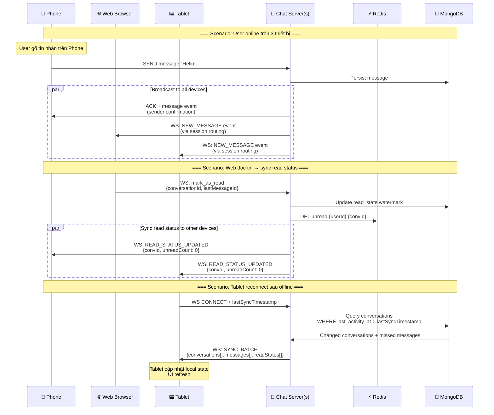

### 6.1 Sync Protocol

```java
/**
 * Khi thiết bị reconnect sau thời gian offline hoặc mất mạng.
 * Gửi delta changes kể từ lần sync cuối.
 */
@MessageMapping("/chat.sync")
public void handleSyncRequest(
        @Payload SyncRequest request,   // { lastSyncTimestamp }
        SimpMessageHeaderAccessor headerAccessor) {

    Long userId = extractUserId(headerAccessor);
    Instant lastSync = request.getLastSyncTimestamp();

    // 1. Conversations có thay đổi kể từ lastSync
    List<ConversationDocument> changedConversations =
        conversationRepository.findByParticipantIdsAndLastActivityAtAfter(
            userId, lastSync
        );

    // 2. Messages mới trong các conversations đó
    Map<String, List<MessageDocument>> missedMessages = new HashMap<>();
    for (ConversationDocument conv : changedConversations) {
        List<MessageDocument> messages = messageRepository
            .findByConversationIdAndCreatedAtAfter(conv.getId(), lastSync);
        missedMessages.put(conv.getId().toHexString(), messages);
    }

    // 3. Read states hiện tại
    Map<String, Integer> unreadCounts = getUnreadCounts(userId, changedConversations);

    // 4. Gửi batch sync response
    SyncResponse response = SyncResponse.builder()
        .conversations(changedConversations)
        .messages(missedMessages)
        .unreadCounts(unreadCounts)
        .serverTimestamp(Instant.now())
        .build();

    messagingTemplate.convertAndSendToUser(
        userId.toString(), "/queue/sync", response
    );
}
```

---

## 7. Luồng Nhóm Chat (Group Chat Flow)

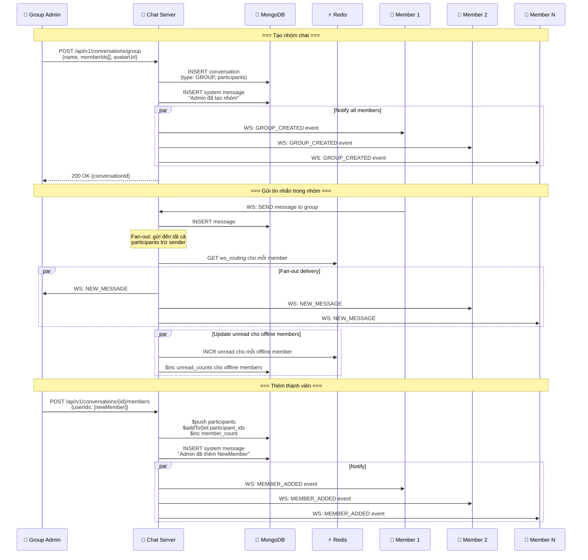

### 7.1 Group Operations — Giới hạn & Quy tắc

| Operation | Ai được phép | Giới hạn |
|-----------|-------------|----------|
| Tạo nhóm | Bất kỳ user | Max 500 members, min 3 (bao gồm creator) |
| Thêm member | OWNER, ADMIN | Kiểm tra friendship, block list |
| Xóa member | OWNER, ADMIN (ko xóa OWNER) | Admin không thể xóa Admin khác |
| Đổi tên/avatar nhóm | OWNER, ADMIN (nếu `only_admins_can_edit_info`) | Max 100 chars name |
| Promote/Demote Admin | OWNER only | Max 10 admins per group |
| Chuyển quyền OWNER | OWNER only | Chỉ chuyển cho member hiện tại |
| Rời nhóm | Bất kỳ member | OWNER phải chuyển quyền trước khi rời |
| Xóa nhóm | OWNER only | Soft delete, giữ message history |
| Ghim tin nhắn | OWNER, ADMIN | Max 50 pinned messages per group |

---

## 8. Quản Lý Trạng Thái (State Management)

### 8.1 Presence System

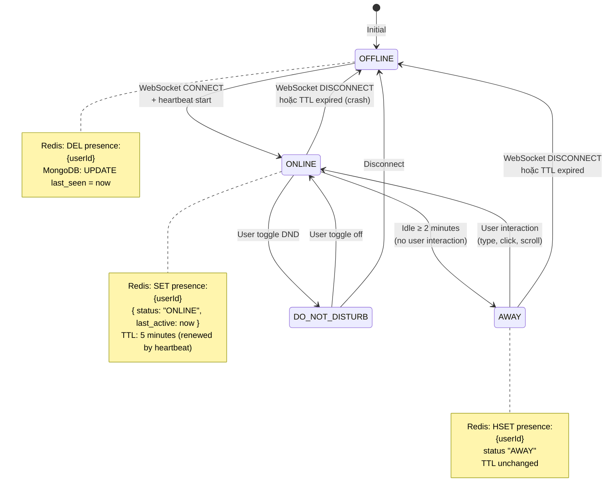

### 8.2 Trạng thái tin nhắn (Message Status)

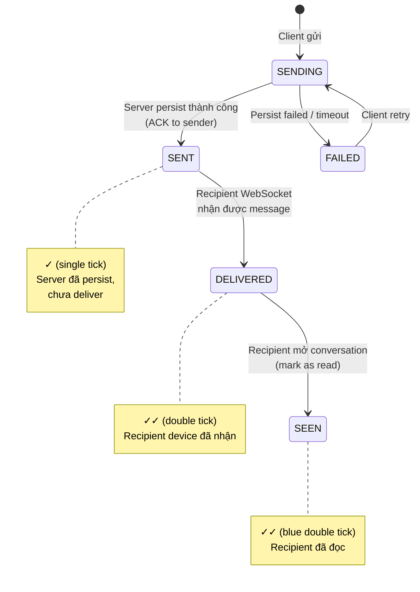

---

## 9. Phân Phối Trạng Thái Tới Bạn Bè (Presence Distribution)

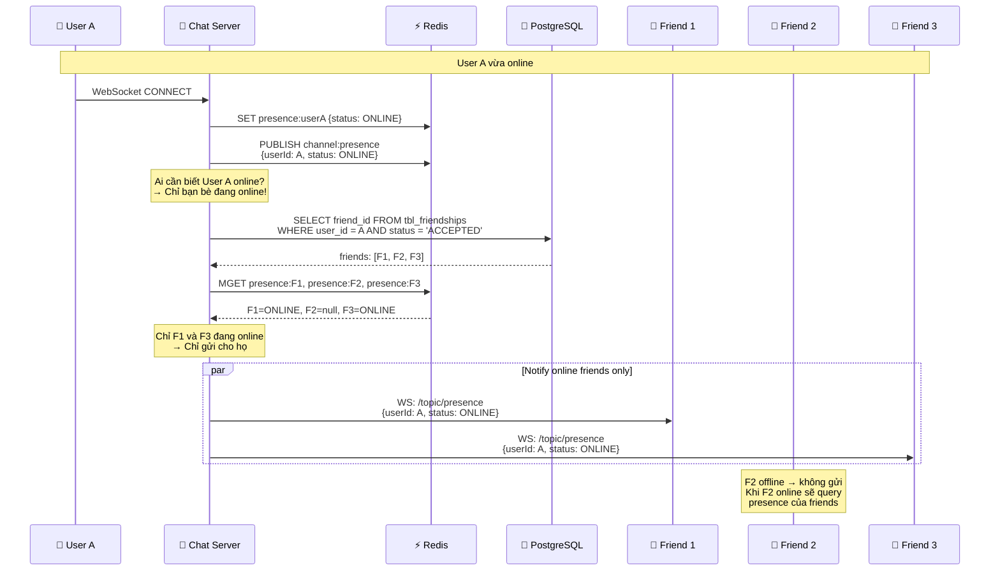

### 9.1 Optimization: Friend List Cache

```java
/**
 * Cache friend list trong Redis để tránh query PostgreSQL mỗi lần.
 * Invalidate khi có thay đổi (accept/remove friend).
 */
@Service
@RequiredArgsConstructor
public class FriendCacheService {

    private final RedisTemplate<String, String> redisTemplate;
    private static final String FRIEND_LIST_KEY = "friends:";
    private static final Duration FRIEND_CACHE_TTL = Duration.ofHours(1);

    // Key: friends:{userId} → Set<friendId>
    public Set<Long> getCachedFriendIds(Long userId) {
        String key = FRIEND_LIST_KEY + userId;
        Set<String> cached = redisTemplate.opsForSet().members(key);

        if (cached == null || cached.isEmpty()) {
            // Cache miss → Query PostgreSQL → Cache kết quả
            Set<Long> friendIds = friendshipRepository.findAcceptedFriendIds(userId);
            friendIds.forEach(id ->
                redisTemplate.opsForSet().add(key, id.toString())
            );
            redisTemplate.expire(key, FRIEND_CACHE_TTL);
            return friendIds;
        }

        return cached.stream().map(Long::parseLong).collect(Collectors.toSet());
    }

    // Invalidate khi friend list thay đổi
    public void invalidateFriendCache(Long userId) {
        redisTemplate.delete(FRIEND_LIST_KEY + userId);
    }
}
```

---

## 10. Định Tuyến Tin Nhắn Giữa Các Server (Cross-Server Routing)

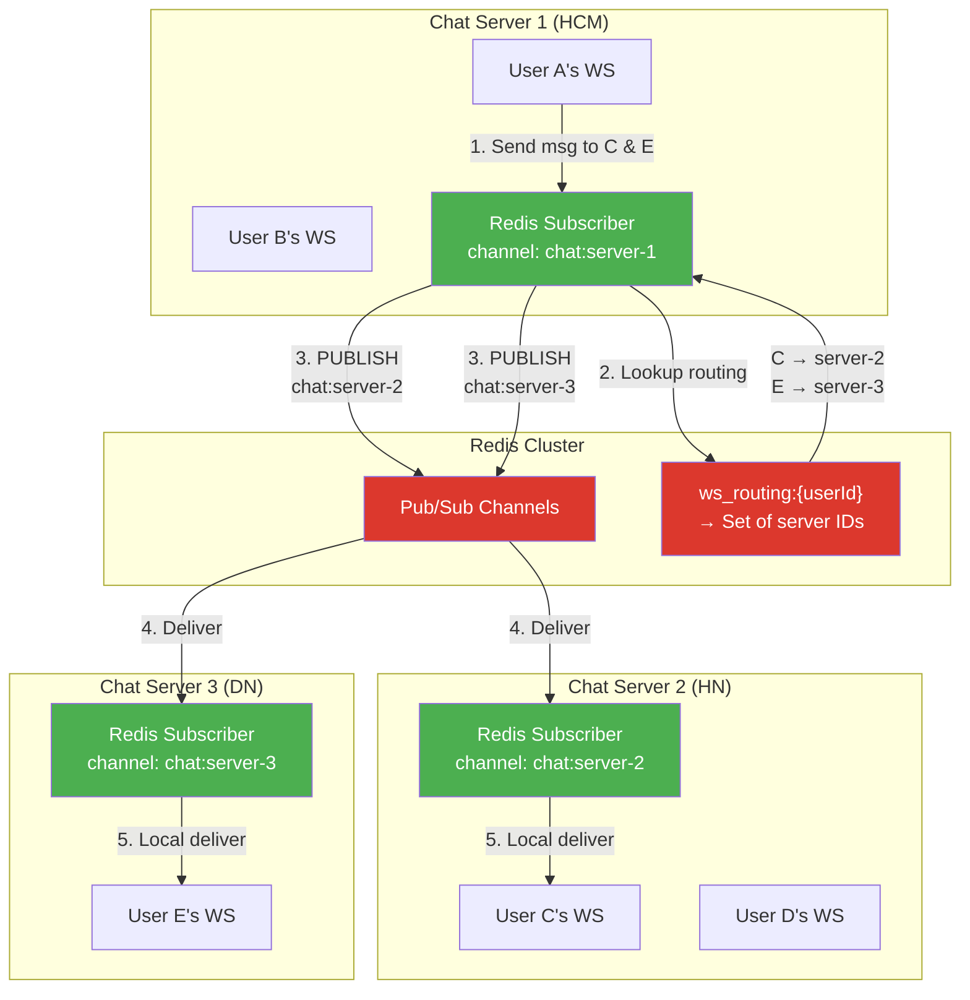

### 10.1 Cross-Server Message Router Implementation

```java
@Component
@RequiredArgsConstructor
@Slf4j(topic = "MESSAGE_ROUTER")
public class CrossServerMessageRouter {

    private final RedisTemplate<String, String> redisTemplate;
    private final SimpMessagingTemplate messagingTemplate;
    private final WebSocketSessionManager sessionManager;
    private final ObjectMapper objectMapper;

    @Value("${app.server.id}")
    private String serverId;

    /**
     * Route message to all recipients across all server instances
     */
    public void routeToRecipients(MessageDocument message,
                                   List<Long> recipientIds) {
        // 1. Nhóm recipients theo server
        Map<String, List<Long>> serverToUsers = new HashMap<>();

        for (Long userId : recipientIds) {
            Set<String> servers = sessionManager.getServersForUser(userId);
            if (servers != null) {
                for (String targetServer : servers) {
                    serverToUsers.computeIfAbsent(targetServer, k -> new ArrayList<>())
                                 .add(userId);
                }
            }
        }

        // 2. Deliver locally (same server)
        List<Long> localUsers = serverToUsers.remove(serverId);
        if (localUsers != null) {
            deliverLocally(message, localUsers);
        }

        // 3. Publish to remote servers via Redis Pub/Sub
        for (Map.Entry<String, List<Long>> entry : serverToUsers.entrySet()) {
            String targetServer = entry.getKey();
            CrossServerMessage csm = CrossServerMessage.builder()
                .message(message)
                .targetUserIds(entry.getValue())
                .sourceServerId(serverId)
                .build();

            String channel = "chat:server:" + targetServer;
            redisTemplate.convertAndSend(channel, objectMapper.writeValueAsString(csm));
            log.debug("Routed message to server: {} for {} users",
                       targetServer, entry.getValue().size());
        }
    }

    /**
     * Redis Subscriber — nhận message từ server khác
     */
    @RedisListener(channel = "chat:server:${app.server.id}")
    public void onCrossServerMessage(String rawMessage) {
        CrossServerMessage csm = objectMapper.readValue(rawMessage, CrossServerMessage.class);
        deliverLocally(csm.getMessage(), csm.getTargetUserIds());
    }

    private void deliverLocally(MessageDocument message, List<Long> userIds) {
        String destination = "/topic/conversation/" +
                             message.getConversationId().toHexString();
        MessageResponse response = MessageMapper.toResponse(message);

        for (Long userId : userIds) {
            messagingTemplate.convertAndSendToUser(
                userId.toString(), destination, response
            );
        }
    }
}
```

---

## 11. Khả Năng Chịu Lỗi & Phục Hồi (Fault Tolerance)

### 11.1 Failure Scenarios & Recovery

```mermaid
graph TB
    subgraph "Failure Scenario: Chat Server crash"
        CRASH["💥 Server 2 crash"]
        DETECT["Redis TTL expired<br/>(ws_routing keys)"]
        REBALANCE["Clients auto-reconnect<br/>→ Load Balancer<br/>→ Healthy server"]
        RESYNC["Sync delta messages<br/>since last connection"]
    end

    subgraph "Failure Scenario: MongoDB primary down"
        MONGO_FAIL["💥 MongoDB primary fail"]
        ELECTION["Replica Set election<br/>(~10-15 seconds)"]
        NEW_PRIMARY["New primary elected"]
        RETRY["Spring Retry template<br/>auto-retry writes"]
    end

    subgraph "Failure Scenario: Redis down"
        REDIS_FAIL["💥 Redis node fail"]
        SENTINEL["Redis Sentinel<br/>automatic failover"]
        FALLBACK["Fallback: direct DB query<br/>for presence/unread"]
        RECOVER["Redis Cluster self-heal"]
    end

    CRASH --> DETECT --> REBALANCE --> RESYNC
    MONGO_FAIL --> ELECTION --> NEW_PRIMARY --> RETRY
    REDIS_FAIL --> SENTINEL --> FALLBACK --> RECOVER

    style CRASH fill:#f44336,color:#fff
    style MONGO_FAIL fill:#f44336,color:#fff
    style REDIS_FAIL fill:#f44336,color:#fff
    style REBALANCE fill:#4CAF50,color:#fff
    style NEW_PRIMARY fill:#4CAF50,color:#fff
    style RECOVER fill:#4CAF50,color:#fff
```

### 11.2 Chiến lược chi tiết

| Thành phần | Failure Mode | Recovery Strategy |
|-----------|-------------|-------------------|
| **Chat Server** | Crash/OOM | Kubernetes auto-restart + client auto-reconnect + delta sync |
| **MongoDB** | Primary down | Replica Set auto-election (10-15s) + Spring Retry |
| **PostgreSQL** | Primary down | Streaming Replication + pgPool-II failover |
| **Redis** | Node down | Redis Sentinel/Cluster auto-failover + circuit breaker |
| **Kafka** | Broker down | Replication factor = 3, ISR auto-failover |
| **Load Balancer** | Single LB down | Dual LB (active-passive) hoặc AWS ALB (managed HA) |
| **Network Partition** | Split brain | Redis Pub/Sub retry + message deduplication (idempotency key) |
| **Message Loss** | Server crash before persist | Client-side retry + idempotent write (dedup by clientMessageId) |

### 11.3 Circuit Breaker Pattern

```java
@Configuration
public class ResilienceConfig {

    @Bean
    public Customizer<Resilience4JCircuitBreakerFactory> defaultCustomizer() {
        return factory -> factory.configureDefault(id ->
            new Resilience4JConfigBuilder(id)
                .circuitBreakerConfig(CircuitBreakerConfig.custom()
                    .failureRateThreshold(50)            // Trip khi 50% requests fail
                    .waitDurationInOpenState(Duration.ofSeconds(30))
                    .slidingWindowSize(10)
                    .build())
                .timeLimiterConfig(TimeLimiterConfig.custom()
                    .timeoutDuration(Duration.ofSeconds(3))
                    .build())
                .build()
        );
    }
}
```

---

## 12. Mở Rộng Quy Mô (Scaling Strategy)

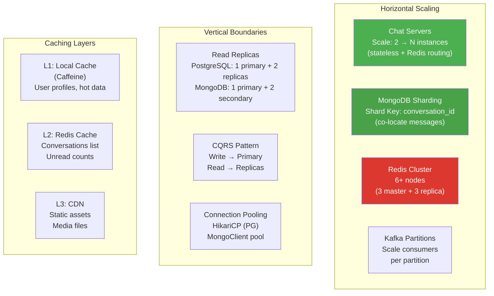

### 12.1 Capacity Planning

| Metric | Target | Strategy |
|--------|--------|----------|
| Concurrent WebSocket connections | 1M per cluster | 50K per Chat Server × 20 instances |
| Messages per second | 100K msg/s | Kafka ingestion + async processing |
| Message storage | 10TB+ | MongoDB sharding (conversation_id hash) |
| API requests/second | 50K req/s | API Gateway rate limiting + caching |
| P99 message latency | < 200ms | Redis routing + local delivery preference |
| Recovery time (RTO) | < 30 seconds | Kubernetes + auto-failover |

---

## 13. Bảo Mật (Security Hardening)

### 13.1 Security Layers

| Layer | Measure | Implementation |
|-------|---------|----------------|
| **Transport** | TLS 1.3 everywhere | Nginx SSL termination, WSS |
| **Authentication** | JWT + Refresh Token rotation | Multi-key JWT (đã có), token rotation on refresh |
| **Authorization** | RBAC + Resource-level | Spring Security, @PreAuthorize, conversation membership check |
| **Rate Limiting** | Token Bucket per user + IP | Redis-based, configurable per endpoint |
| **Input Validation** | Jakarta Validation + Custom | XSS filter, SQL injection prevention, message size limit (4KB text) |
| **Content Moderation** | AI-based filtering | Kafka → Content moderation service (phase 2) |
| **Media Security** | Pre-signed URLs + virus scan | S3 pre-signed URL (expires 15min), ClamAV scan on upload |
| **Encryption at Rest** | Database-level encryption | PostgreSQL TDE, MongoDB encryption at rest, Redis ACL |
| **Audit Trail** | Action logging | Kafka → Audit log service |
| **DDoS Protection** | CDN + WAF | Cloudflare/AWS WAF + connection limit per IP |

### 13.2 WebSocket Authentication Flow

```java
/**
 * STOMP interceptor: validate JWT trước khi cho phép WebSocket CONNECT
 */
@Component
@RequiredArgsConstructor
public class WebSocketAuthInterceptor implements ChannelInterceptor {

    private final JwtUtils jwtUtils;
    private final TokenBlacklistService tokenBlacklistService;

    @Override
    public Message<?> preSend(Message<?> message, MessageChannel channel) {
        StompHeaderAccessor accessor = StompHeaderAccessor.wrap(message);

        if (StompCommand.CONNECT.equals(accessor.getCommand())) {
            String token = extractToken(accessor);

            if (token == null || tokenBlacklistService.isBlacklisted(token)) {
                throw new AppException(ErrorCode.UNAUTHENTICATED);
            }

            try {
                Claims claims = jwtUtils.extractAllClaims(token, TokenType.ACCESS_TOKEN);
                Long userId = claims.get("userId", Long.class);
                String username = claims.getSubject();

                // Set user info vào session attributes
                accessor.getSessionAttributes().put("userId", userId);
                accessor.getSessionAttributes().put("username", username);
                accessor.setUser(new StompPrincipal(userId, username));

            } catch (JwtException e) {
                throw new AppException(ErrorCode.UNAUTHENTICATED);
            }
        }

        return message;
    }
}
```

---

## 14. DevOps & Infrastructure

### 14.1 CI/CD Pipeline

```mermaid
graph LR
    subgraph "CI — Continuous Integration"
        CODE["📝 Push Code"]
        BUILD["🔨 Maven Build<br/>+ Compile"]
        TEST["🧪 Unit Tests<br/>+ Integration Tests"]
        SCAN["🔍 SonarQube<br/>Code Quality"]
        DOCKER["🐳 Docker Build<br/>+ Push to Registry"]
    end

    subgraph "CD — Continuous Deployment"
        STAGE["🟡 Deploy Staging<br/>(K8s namespace)"]
        E2E["🧪 E2E Tests<br/>(Selenium/Playwright)"]
        APPROVE["👤 Manual Approval<br/>(Production gate)"]
        PROD["🟢 Deploy Production<br/>(Rolling update)"]
        MONITOR["📊 Post-deploy<br/>Monitoring"]
    end

    CODE --> BUILD --> TEST --> SCAN --> DOCKER
    DOCKER --> STAGE --> E2E --> APPROVE --> PROD --> MONITOR
```

### 14.2 Docker Compose — Development (Mở rộng)

```yaml
services:
  # === Existing (giữ nguyên) ===
  postgres:
    image: postgis/postgis:16-3.4
    # ... (đã có)

  mongo:
    image: mongo:7.0
    # ... (đã có)

  redis:
    image: redis:7.2-alpine
    # ... (đã có)

  # === Bổ sung mới ===
  kafka:
    image: confluentinc/cp-kafka:7.6.0
    depends_on:
      - zookeeper
    ports:
      - "9092:9092"
    environment:
      KAFKA_BROKER_ID: 1
      KAFKA_ZOOKEEPER_CONNECT: zookeeper:2181
      KAFKA_ADVERTISED_LISTENERS: PLAINTEXT://localhost:9092
      KAFKA_OFFSETS_TOPIC_REPLICATION_FACTOR: 1

  zookeeper:
    image: confluentinc/cp-zookeeper:7.6.0
    ports:
      - "2181:2181"
    environment:
      ZOOKEEPER_CLIENT_PORT: 2181

  minio:
    image: minio/minio:latest
    ports:
      - "9000:9000"
      - "9001:9001"  # Console
    command: server /data --console-address ":9001"
    environment:
      MINIO_ROOT_USER: minioadmin
      MINIO_ROOT_PASSWORD: minioadmin
    volumes:
      - ./data/minio:/data

  elasticsearch:
    image: elasticsearch:8.13.0
    ports:
      - "9200:9200"
    environment:
      - discovery.type=single-node
      - xpack.security.enabled=false
      - "ES_JAVA_OPTS=-Xms512m -Xmx512m"
    volumes:
      - ./data/elasticsearch:/usr/share/elasticsearch/data
```

### 14.3 Kubernetes Production Architecture

```yaml
# Simplified K8s deployment structure
Namespace: vivumate-prod
├── Deployments
│   ├── chat-server         (3-10 replicas, HPA)
│   ├── auth-service        (2-3 replicas)
│   ├── user-service        (2-3 replicas)
│   ├── media-service       (2-3 replicas)
│   ├── notification-service (2-3 replicas)
│   └── search-service      (2 replicas)
├── StatefulSets
│   ├── mongodb-replica-set (3 nodes)
│   ├── redis-cluster       (6 nodes)
│   ├── kafka-cluster       (3 brokers)
│   └── elasticsearch       (3 nodes)
├── Services
│   ├── chat-server-svc     (ClusterIP, headless for WS)
│   └── api-gateway-svc     (LoadBalancer)
├── Ingress
│   └── nginx-ingress       (TLS termination, sticky sessions)
├── ConfigMaps & Secrets
│   ├── app-config
│   └── db-secrets (from Vault)
└── HPA (Horizontal Pod Autoscaler)
    └── chat-server: CPU > 60% → scale up
```

---

## 15. Sơ Đồ Tổng Hợp — Data Flow Overview

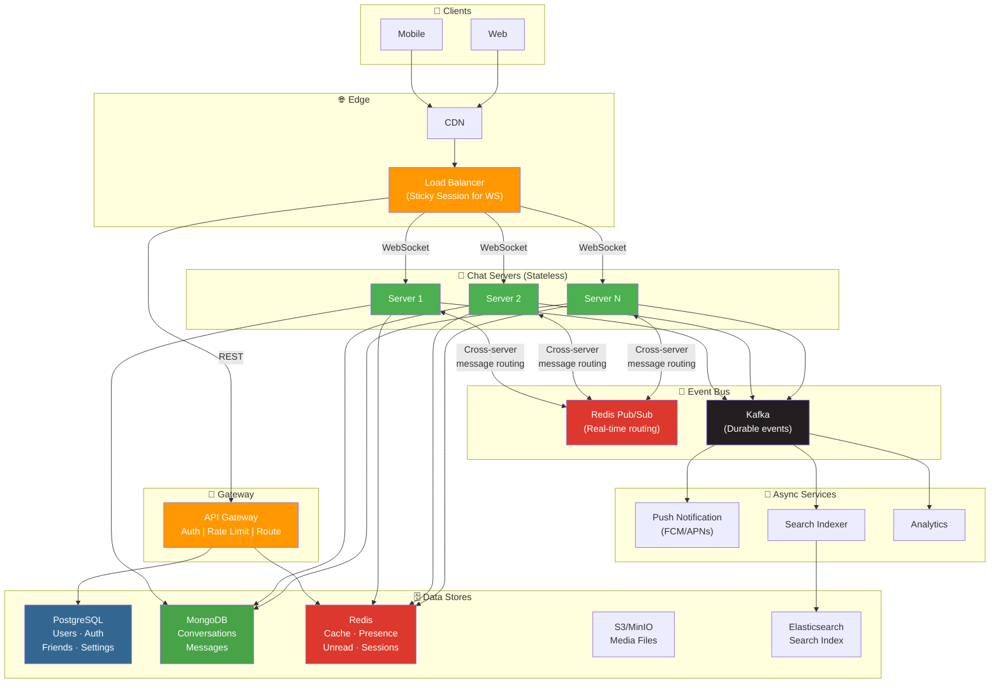

---

## 16. Danh Sách Bài Toán Cần Giải Quyết

> [!IMPORTANT]
> Dưới đây là **tất cả các bài toán** cần giải quyết, sắp xếp theo thứ tự ưu tiên từ foundation → advanced.

### 🏗️ Foundation (Phase 1-3)

| # | Bài toán | Mô tả | Priority |
|---|---------|-------|----------|
| 1 | **WebSocket Infrastructure** | Setup Spring WebSocket + STOMP, auth interceptor, session management | 🔴 Critical |
| 2 | **Message CRUD** | Send, receive, edit, delete, reply messages | 🔴 Critical |
| 3 | **Conversation Management** | Create/update DM & Group, member management | 🔴 Critical |
| 4 | **Presence System** | Online/offline/away with Redis + heartbeat | 🔴 Critical |
| 5 | **Unread Count** | Real-time unread counter per user per conversation | 🔴 Critical |
| 6 | **Multi-device Sync** | Delta sync on reconnect, broadcast to all devices | 🔴 Critical |
| 7 | **Friendship System** | Friend request, accept, block, unfriend | 🟡 High |
| 8 | **Typing Indicator** | Real-time typing status via Redis + WS | 🟡 High |
| 9 | **Message Read Status** | Watermark-based read tracking + delivery receipt | 🟡 High |
| 10 | **Media Upload** | Image/file/video upload to S3/MinIO + message attachment | 🟡 High |

### 🚀 Growth (Phase 4-5)

| # | Bài toán | Mô tả | Priority |
|---|---------|-------|----------|
| 11 | **Cross-Server Routing** | Redis Pub/Sub for multi-instance message routing | 🟡 High |
| 12 | **Push Notifications** | FCM/APNs integration, offline notification via Kafka | 🟡 High |
| 13 | **Group Chat Advanced** | Admin roles, permissions, settings, pin messages | 🟢 Medium |
| 14 | **Message Search** | Full-text search via Elasticsearch | 🟢 Medium |
| 15 | **User Profile Sync** | Background job to update denormalized snapshots | 🟢 Medium |
| 16 | **Rate Limiting** | Per-user, per-IP, per-endpoint rate limiting | 🟢 Medium |
| 17 | **Message Reactions** | Emoji reactions on messages | 🟢 Medium |

### 🏰 Production-Ready (Phase 6-8)

| # | Bài toán | Mô tả | Priority |
|---|---------|-------|----------|
| 18 | **Fault Tolerance** | Circuit breaker, retry, fallback strategies | 🟢 Medium |
| 19 | **Database Scaling** | MongoDB sharding, PostgreSQL read replicas | 🔵 Low (plan now) |
| 20 | **Monitoring & Alerting** | Prometheus + Grafana dashboards, custom metrics | 🟢 Medium |
| 21 | **CI/CD Pipeline** | GitHub Actions → Docker → K8s deployment | 🟢 Medium |
| 22 | **E2E Encryption** | Optional E2E encryption for DM conversations | 🔵 Low |
| 23 | **Voice/Video Calls** | WebRTC signaling server integration | 🔵 Low |
| 24 | **Content Moderation** | AI-based spam/abuse detection | 🔵 Low |
| 25 | **Analytics Dashboard** | Message volume, DAU/MAU, engagement metrics | 🔵 Low |

---

## 17. Implementation Roadmap — Step-by-Step

> Mỗi Phase xây dựng trên nền của Phase trước. Bắt đầu từ cơ bản nhất, mở rộng dần.

---

### 📌 Phase 1: WebSocket Foundation & Real-time Infrastructure
**Timeline ước lượng: 2-3 tuần**

- [ ] **1.1 WebSocket Configuration**
  - [ ] 1.1.1 Cấu hình `WebSocketConfig` implements `WebSocketMessageBrokerConfigurer`
  - [ ] 1.1.2 Register STOMP endpoints: `/ws-connect` (SockJS fallback)
  - [ ] 1.1.3 Configure message broker: Simple broker (`/topic`, `/queue`) → sau nâng lên external broker (RabbitMQ/Redis)
  - [ ] 1.1.4 Configure application destination prefix: `/app`
  - [ ] 1.1.5 Enable Virtual Threads cho WebSocket task executor

- [ ] **1.2 WebSocket Authentication**
  - [ ] 1.2.1 Implement `WebSocketAuthInterceptor` (ChannelInterceptor)
  - [ ] 1.2.2 JWT validation on STOMP CONNECT frame
  - [ ] 1.2.3 Extract userId, username → set vào session attributes
  - [ ] 1.2.4 Handle authentication failures (close connection gracefully)
  - [ ] 1.2.5 Implement `StompPrincipal` để Spring biết user identity

- [ ] **1.3 WebSocket Session Management**
  - [ ] 1.3.1 Implement `WebSocketSessionManager` (ConcurrentHashMap local + Redis global)
  - [ ] 1.3.2 `WebSocketEventListener`: handle `SessionConnectedEvent`, `SessionDisconnectEvent`
  - [ ] 1.3.3 Multi-device support: 1 userId → multiple sessionIds
  - [ ] 1.3.4 Redis key: `ws_routing:{userId}` → Set of serverIds
  - [ ] 1.3.5 Heartbeat configuration (server-side: 25s, client-side: 25s)

- [ ] **1.4 Connection Lifecycle**
  - [ ] 1.4.1 CONNECT: auth → register session → update presence → load initial data
  - [ ] 1.4.2 DISCONNECT: remove session → update presence → persist last_seen
  - [ ] 1.4.3 HEARTBEAT: renew Redis TTL cho presence
  - [ ] 1.4.4 ERROR handling: reconnect strategy (exponential backoff)

---

### 📌 Phase 2: Core Messaging — CRUD Operations
**Timeline ước lượng: 3-4 tuần**

- [ ] **2.1 Send Message**
  - [ ] 2.1.1 STOMP handler: `@MessageMapping("/chat.send")`
  - [ ] 2.1.2 Validate: conversation membership, content size (max 4KB text), rate limit
  - [ ] 2.1.3 Build `MessageDocument` (enrich sender snapshot, parse mentions)
  - [ ] 2.1.4 Persist to MongoDB
  - [ ] 2.1.5 Update `ConversationDocument`: last_message, last_activity_at
  - [ ] 2.1.6 ACK to sender: `{messageId, timestamp, status: SENT}`

- [ ] **2.2 Receive Message (Real-time Delivery)**
  - [ ] 2.2.1 Local delivery: `SimpMessagingTemplate.convertAndSendToUser()`
  - [ ] 2.2.2 Destination: `/user/{userId}/queue/messages`
  - [ ] 2.2.3 Broadcast to all devices of recipient
  - [ ] 2.2.4 Client-side handling: sort by timestamp, dedup by messageId

- [ ] **2.3 Load Message History**
  - [ ] 2.3.1 REST API: `GET /api/v1/conversations/{id}/messages?cursor={lastId}&limit=30`
  - [ ] 2.3.2 Cursor-based pagination (ObjectId as cursor)
  - [ ] 2.3.3 Filter: exclude `deletedFor` current user, exclude `deletedForEveryone`
  - [ ] 2.3.4 Response: `PageResponse<MessageResponse>`

- [ ] **2.4 Edit Message**
  - [ ] 2.4.1 STOMP handler: `@MessageMapping("/chat.edit")`
  - [ ] 2.4.2 Validation: only sender can edit, within time window (15 min)
  - [ ] 2.4.3 Save previous content to `previousEdit`
  - [ ] 2.4.4 Set `isEdited = true`
  - [ ] 2.4.5 Broadcast edit event to all conversation participants

- [ ] **2.5 Delete Message**
  - [ ] 2.5.1 "Delete for me": add userId to `deletedFor` array
  - [ ] 2.5.2 "Delete for everyone": set `deletedForEveryone = true` (sender only, within 1 hour)
  - [ ] 2.5.3 Broadcast delete event
  - [ ] 2.5.4 Update `lastMessage` in conversation if deleted message was the last one

- [ ] **2.6 Reply Message**
  - [ ] 2.6.1 Include `replyTo` snapshot in new message
  - [ ] 2.6.2 Validate: original message exists in same conversation
  - [ ] 2.6.3 Display logic: show reply preview in message bubble

- [ ] **2.7 Mention System**
  - [ ] 2.7.1 Parse @mentions from message text (regex: `@username`)
  - [ ] 2.7.2 Store `mentions[]` in message document
  - [ ] 2.7.3 Increment `unreadMentions` counter
  - [ ] 2.7.4 Notification: prioritize mention notifications

---

### 📌 Phase 3: Conversation Management
**Timeline ước lượng: 2-3 tuần**

- [ ] **3.1 Direct Message (DM)**
  - [ ] 3.1.1 REST API: `POST /api/v1/conversations/direct` `{recipientId}`
  - [ ] 3.1.2 Check existing DM (unique constraint on `dmHash`)
  - [ ] 3.1.3 If exists → return existing conversation
  - [ ] 3.1.4 If not → create new with `dmHash = min_max` format
  - [ ] 3.1.5 Validate: not blocked, is friend (optional setting)

- [ ] **3.2 Group Chat — Creation**
  - [ ] 3.2.1 REST API: `POST /api/v1/conversations/group` `{name, memberIds[], avatarUrl}`
  - [ ] 3.2.2 Validate: 3-500 members, name length, creator auto-added as OWNER
  - [ ] 3.2.3 Create conversation + system message "X đã tạo nhóm"
  - [ ] 3.2.4 Notify all members via WebSocket

- [ ] **3.3 Group Chat — Member Management**
  - [ ] 3.3.1 Add members: `POST /api/v1/conversations/{id}/members`
  - [ ] 3.3.2 Remove members: `DELETE /api/v1/conversations/{id}/members/{userId}`
  - [ ] 3.3.3 Leave group: `POST /api/v1/conversations/{id}/leave`
  - [ ] 3.3.4 System messages for all member changes
  - [ ] 3.3.5 Permission checks (OWNER/ADMIN roles)

- [ ] **3.4 Group Chat — Settings & Roles**
  - [ ] 3.4.1 Update group info: name, avatar, description
  - [ ] 3.4.2 Promote/demote admin
  - [ ] 3.4.3 Transfer ownership
  - [ ] 3.4.4 Toggle settings: `onlyAdminsCanSend`, `onlyAdminsCanEditInfo`
  - [ ] 3.4.5 Mute conversation: per-user `isMuted`, `mutedUntil`

- [ ] **3.5 Conversation List**
  - [ ] 3.5.1 REST API: `GET /api/v1/conversations?cursor={lastActivityAt}&limit=20`
  - [ ] 3.5.2 Sort by `lastActivityAt` DESC
  - [ ] 3.5.3 Include: last_message preview, unread count, participant info
  - [ ] 3.5.4 Cursor-based pagination
  - [ ] 3.5.5 Filter: exclude conversations where user has "cleared history" (watermark pattern)

---

### 📌 Phase 4: Presence, Typing & Read Status
**Timeline ước lượng: 2 tuần**

- [ ] **4.1 Presence System**
  - [ ] 4.1.1 Redis key: `presence:{userId}` → Hash {status, lastActive}
  - [ ] 4.1.2 TTL: 5 minutes, renewed by heartbeat
  - [ ] 4.1.3 States: ONLINE → AWAY (2min idle) → OFFLINE (disconnect/TTL)
  - [ ] 4.1.4 Redis Keyspace Notifications cho TTL expired detection
  - [ ] 4.1.5 Broadcast presence changes to online friends only

- [ ] **4.2 Typing Indicator**
  - [ ] 4.2.1 STOMP: `@MessageMapping("/chat.typing")`
  - [ ] 4.2.2 Redis SET: `typing:{conversationId}` → userIds, TTL 3s
  - [ ] 4.2.3 Broadcast to conversation participants
  - [ ] 4.2.4 Client-side: re-send every 2s while typing, auto-hide after 3s

- [ ] **4.3 Message Read Status (Watermark Pattern)**
  - [ ] 4.3.1 Collection: `message_read_states` → {userId, conversationId, lastReadMessageId, lastDeliveredMessageId, readAt}
  - [ ] 4.3.2 Mark as read: update watermark, reset unread count
  - [ ] 4.3.3 Delivery receipt: update lastDeliveredMessageId
  - [ ] 4.3.4 Broadcast read/delivered events to sender
  - [ ] 4.3.5 Sync read status across devices

- [ ] **4.4 Unread Count System**
  - [ ] 4.4.1 Redis: `unread:{userId}:{conversationId}` → integer
  - [ ] 4.4.2 Increment on new message (Redis $+$ MongoDB parallel)
  - [ ] 4.4.3 Reset on mark-as-read (Redis DEL + MongoDB set 0)
  - [ ] 4.4.4 Total unread badge: `unread:total:{userId}` (sum across conversations)
  - [ ] 4.4.5 Consistency: periodic sync job Redis ↔ MongoDB

---

### 📌 Phase 5: Friendship & User Features
**Timeline ước lượng: 2 tuần**

- [ ] **5.1 Friendship System (PostgreSQL)**
  - [ ] 5.1.1 Entity: `Friendship` (userId, friendId, status: PENDING/ACCEPTED, createdAt)
  - [ ] 5.1.2 Send friend request: `POST /api/v1/friends/request` `{userId}`
  - [ ] 5.1.3 Accept/reject request: `PUT /api/v1/friends/request/{id}`
  - [ ] 5.1.4 Unfriend: `DELETE /api/v1/friends/{userId}`
  - [ ] 5.1.5 List friends: `GET /api/v1/friends?page=1&size=20`
  - [ ] 5.1.6 Real-time notification for friend requests

- [ ] **5.2 Block System**
  - [ ] 5.2.1 Block user: `POST /api/v1/users/{id}/block`
  - [ ] 5.2.2 Unblock: `DELETE /api/v1/users/{id}/block`
  - [ ] 5.2.3 Check block status before: send message, create DM, send friend request
  - [ ] 5.2.4 Blocked user không thấy online status

- [ ] **5.3 User Settings**
  - [ ] 5.3.1 Notification preferences (mute all, mute specific conversations)
  - [ ] 5.3.2 Privacy settings (who can send friend request, who can see online status)
  - [ ] 5.3.3 Theme/language preferences
  - [ ] 5.3.4 Device management (list active devices, logout specific device)

- [ ] **5.4 Media Upload Service**
  - [ ] 5.4.1 S3/MinIO configuration
  - [ ] 5.4.2 Upload API: `POST /api/v1/media/upload` (multipart/form-data)
  - [ ] 5.4.3 Generate presigned URL for direct upload (large files)
  - [ ] 5.4.4 Image processing: resize, thumbnail generation (Java ImageIO hoặc Thumbnailator)
  - [ ] 5.4.5 File type validation: whitelist allowed MIME types
  - [ ] 5.4.6 Size limits: image 10MB, file 50MB, video 100MB

---

### 📌 Phase 6: Scaling & Cross-Server Communication
**Timeline ước lượng: 2-3 tuần**

- [ ] **6.1 Cross-Server Message Routing**
  - [ ] 6.1.1 Redis Pub/Sub: subscribe `chat:server:{serverId}`
  - [ ] 6.1.2 `CrossServerMessageRouter`: lookup target servers → publish
  - [ ] 6.1.3 `@RedisListener` on each chat server instance
  - [ ] 6.1.4 Server ID: from environment variable or hostname

- [ ] **6.2 Kafka Event Streaming**
  - [ ] 6.2.1 Topics: `chat.messages`, `chat.notifications`, `chat.analytics`, `chat.search-index`
  - [ ] 6.2.2 Producer: publish events after message persist
  - [ ] 6.2.3 Consumer groups: notification-service, search-indexer, analytics
  - [ ] 6.2.4 Dead letter queue for failed processing

- [ ] **6.3 Push Notification Service**
  - [ ] 6.3.1 Kafka consumer: `chat.notifications` topic
  - [ ] 6.3.2 FCM (Android) integration: firebase-admin SDK
  - [ ] 6.3.3 APNs (iOS) integration: pushy library
  - [ ] 6.3.4 Notification payload: title, body, data (conversationId, messageId)
  - [ ] 6.3.5 Respect mute settings, DND mode
  - [ ] 6.3.6 Device token management (register, refresh, cleanup stale tokens)

- [ ] **6.4 Search Service (Elasticsearch)**
  - [ ] 6.4.1 Kafka consumer: `chat.search-index` topic
  - [ ] 6.4.2 Index mapping: messages, conversations
  - [ ] 6.4.3 Search API: `GET /api/v1/search/messages?q={keyword}&conversationId={id}`
  - [ ] 6.4.4 Vietnamese language support (ICU analyzer)

---

### 📌 Phase 7: Production Hardening
**Timeline ước lượng: 2-3 tuần**

- [ ] **7.1 Resilience Patterns**
  - [ ] 7.1.1 Add `spring-cloud-starter-circuitbreaker-resilience4j`
  - [ ] 7.1.2 Circuit breaker cho external calls (MongoDB, Redis, Kafka)
  - [ ] 7.1.3 Retry with exponential backoff
  - [ ] 7.1.4 Fallback strategies (cache-first khi DB down)
  - [ ] 7.1.5 Bulkhead pattern: isolate thread pools per service

- [ ] **7.2 Rate Limiting**
  - [ ] 7.2.1 Redis-based Token Bucket algorithm
  - [ ] 7.2.2 Per-user: 60 messages/minute, 5 group creates/hour
  - [ ] 7.2.3 Per-IP: 100 API calls/minute (unauthenticated)
  - [ ] 7.2.4 Rate limit response: `429 Too Many Requests` + `Retry-After` header

- [ ] **7.3 Monitoring & Observability**
  - [ ] 7.3.1 Micrometer + Prometheus: custom metrics (ws_connections, messages_sent, message_latency)
  - [ ] 7.3.2 Grafana dashboards: system health, business metrics
  - [ ] 7.3.3 AlertManager: CPU > 80%, error rate > 5%, P99 latency > 500ms
  - [ ] 7.3.4 Distributed tracing: OpenTelemetry + Jaeger
  - [ ] 7.3.5 Structured logging: JSON format, correlation IDs

- [ ] **7.4 Database Optimization**
  - [ ] 7.4.1 MongoDB: connection pool tuning, write concern, read preference
  - [ ] 7.4.2 PostgreSQL: HikariCP tuning, connection pool sizing
  - [ ] 7.4.3 Redis: pipeline operations, Lua scripts for atomic operations
  - [ ] 7.4.4 Query profiling: MongoDB Profiler, PostgreSQL EXPLAIN ANALYZE
  - [ ] 7.4.5 Index review: unused index cleanup, compound index optimization

- [ ] **7.5 Security Hardening**
  - [ ] 7.5.1 Content sanitization (XSS prevention in messages)
  - [ ] 7.5.2 File upload security: virus scan, MIME type validation
  - [ ] 7.5.3 WebSocket connection limits per user (max 5 devices)
  - [ ] 7.5.4 Audit logging: login attempts, permission changes, message deletions

---

### 📌 Phase 8: Advanced Features & DevOps
**Timeline ước lượng: 3-4 tuần (ongoing)**

- [ ] **8.1 CI/CD Pipeline**
  - [ ] 8.1.1 GitHub Actions: build → test → Docker image → push to registry
  - [ ] 8.1.2 Staging environment (K8s namespace)
  - [ ] 8.1.3 Production deployment: rolling update, blue-green strategy
  - [ ] 8.1.4 Database migration strategy: Mongock (MongoDB), Flyway (PostgreSQL)

- [ ] **8.2 Containerization & Orchestration**
  - [ ] 8.2.1 Dockerfile optimization: multi-stage build, JRE-only final stage
  - [ ] 8.2.2 Kubernetes manifests: Deployment, Service, ConfigMap, Secret, HPA
  - [ ] 8.2.3 Helm charts for reproducible deployments
  - [ ] 8.2.4 Resource limits và requests tuning

- [ ] **8.3 Database Scaling**
  - [ ] 8.3.1 MongoDB: Replica Set (1 primary + 2 secondary) → Sharding khi cần
  - [ ] 8.3.2 PostgreSQL: Primary + Read Replica(s)
  - [ ] 8.3.3 Redis: Cluster mode (3 master + 3 replica)
  - [ ] 8.3.4 Connection pooling: PgBouncer, Redis connection pool

- [ ] **8.4 Advanced Chat Features (Future)**
  - [ ] 8.4.1 Message forwarding
  - [ ] 8.4.2 Pinned messages
  - [ ] 8.4.3 Message reactions (emoji)
  - [ ] 8.4.4 Polls/Surveys in group chat
  - [ ] 8.4.5 Vanish mode (auto-delete messages)
  - [ ] 8.4.6 Voice messages
  - [ ] 8.4.7 Voice/Video calls (WebRTC signaling)

- [ ] **8.5 Testing Strategy**
  - [ ] 8.5.1 Unit tests: Service layer (JUnit 5 + Mockito)
  - [ ] 8.5.2 Integration tests: Repository layer (Testcontainers)
  - [ ] 8.5.3 WebSocket tests: STOMP client test
  - [ ] 8.5.4 Load tests: Gatling/k6 for WebSocket throughput
  - [ ] 8.5.5 E2E tests: Full flow testing
  - [ ] 8.5.6 Target: 80%+ code coverage on critical paths

---

## 18. Tổng Kết Dependencies Cần Thêm

```xml
<!-- pom.xml — Bổ sung dependencies -->

<!-- WebSocket đã có, nhưng cần thêm: -->

<!-- Kafka -->
<dependency>
    <groupId>org.springframework.kafka</groupId>
    <artifactId>spring-kafka</artifactId>
</dependency>

<!-- AWS S3 / MinIO -->
<dependency>
    <groupId>software.amazon.awssdk</groupId>
    <artifactId>s3</artifactId>
    <version>2.25.x</version>
</dependency>

<!-- Elasticsearch -->
<dependency>
    <groupId>org.springframework.boot</groupId>
    <artifactId>spring-boot-starter-data-elasticsearch</artifactId>
</dependency>

<!-- Resilience4j -->
<dependency>
    <groupId>org.springframework.cloud</groupId>
    <artifactId>spring-cloud-starter-circuitbreaker-resilience4j</artifactId>
</dependency>

<!-- Micrometer + Prometheus -->
<dependency>
    <groupId>io.micrometer</groupId>
    <artifactId>micrometer-registry-prometheus</artifactId>
</dependency>

<!-- OpenTelemetry (Tracing) -->
<dependency>
    <groupId>io.micrometer</groupId>
    <artifactId>micrometer-tracing-bridge-otel</artifactId>
</dependency>

<!-- Image Processing -->
<dependency>
    <groupId>net.coobird</groupId>
    <artifactId>thumbnailator</artifactId>
    <version>0.4.20</version>
</dependency>

<!-- Database Migration -->
<dependency>
    <groupId>io.mongock</groupId>
    <artifactId>mongock-springboot-v3</artifactId>
    <version>5.4.x</version>
</dependency>
```

---

> [!CAUTION]
> **Không nên implement tất cả cùng lúc!** Tuân theo roadmap từ Phase 1 → Phase 8. Mỗi phase phải **hoàn thành và test kỹ** trước khi chuyển sang phase tiếp theo. MVP (Phase 1-3) đã đủ để demo và test real-world scenarios.

> [!TIP]
> **Quick Win**: Phase 1 + Phase 2 có thể demo được trong 3-4 tuần nếu focus. Đây là foundation quan trọng nhất — tất cả phase sau đều build trên nền này.
